# dp-saksbehandling — Komplett dokumentasjon

Backend-applikasjon for saksbehandling av dagpenger hos NAV. Applikasjonen lytter på behandlingshendelser via Kafka (Rapids & Rivers), håndterer oppgavebehandling, klagebehandling, utsending av vedtaksbrev, og innsending av dokumenter.

---

## Innholdsfortegnelse

1. [Arkitektur](#arkitektur)
2. [Modulstruktur](#modulstruktur)
3. [Domenemodell](#domenemodell)
4. [Tilstandsmaskiner](#tilstandsmaskiner)
5. [Databasediagram](#databasediagram)
6. [API-endepunkter](#api-endepunkter)
7. [Hendelsesflyt (Rapids & Rivers)](#hendelsesflyt-rapids--rivers)
8. [Streams Consumer](#streams-consumer)
9. [Infrastruktur og deploy](#infrastruktur-og-deploy)
10. [Bygge og kjøre](#bygge-og-kjøre)

---

## Arkitektur

### Overordnet systemarkitektur

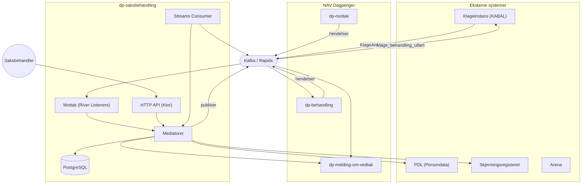

### Intern applikasjonsarkitektur

```mermaid
graph TB
    subgraph "HTTP-lag"
        OppgaveAPI["OppgaveApi"]
        KlageAPI["KlageApi"]
        SakAPI["SakApi"]
        InnsendingAPI["InnsendingApi"]
    end

    subgraph "Mediator-lag"
        OppgaveMediator["OppgaveMediator"]
        KlageMediator["KlageMediator"]
        SakMediator["SakMediator"]
        InnsendingMediator["InnsendingMediator"]
        UtsendingMediator["UtsendingMediator"]
        PersonMediator["PersonMediator"]
    end

    subgraph "Mottak-lag (Kafka)"
        BehandlingOpprettetMottak
        ForslagMottak["ForslagTilBehandlingsresultatMottak"]
        BehandlingsresultatMottak
        BehandlingAvbruttMottak
        KlageinstansVedtakMottak
        UtsendingBehovLøsning["UtsendingBehovLøsningMottak"]
    end

    subgraph "Domene (modell)"
        Sak
        Oppgave
        KlageBehandling
        Utsending
        Innsending
        Person
    end

    subgraph "Database"
        DB[(PostgreSQL)]
    end

    OppgaveAPI --> OppgaveMediator
    KlageAPI --> KlageMediator
    SakAPI --> SakMediator
    InnsendingAPI --> InnsendingMediator

    BehandlingOpprettetMottak --> SakMediator
    ForslagMottak --> OppgaveMediator
    BehandlingsresultatMottak --> OppgaveMediator
    BehandlingAvbruttMottak --> OppgaveMediator
    KlageinstansVedtakMottak --> KlageMediator
    UtsendingBehovLøsning --> UtsendingMediator

    OppgaveMediator --> Oppgave
    KlageMediator --> KlageBehandling
    SakMediator --> Sak
    InnsendingMediator --> Innsending
    UtsendingMediator --> Utsending
    PersonMediator --> Person

    OppgaveMediator --> DB
    KlageMediator --> DB
    SakMediator --> DB
    InnsendingMediator --> DB
    UtsendingMediator --> DB
    PersonMediator --> DB
```

---

## Modulstruktur

| Modul | Formål | Avhengigheter |
|-------|--------|---------------|
| **modell** | Ren domenemodell uten eksterne avhengigheter. Entiteter, tilstandsmaskiner, hendelser. | Kun Kotlin stdlib, Jackson, Aktivitetslogg |
| **mediator** | Applikasjonslag med API, database og meldingshåndtering. Orkestrerer domenelogikk. | Ktor, Kafka Rapids, PostgreSQL, OAuth2, PDL-klient |
| **openapi** | API-kontraktdefinisjoner. Modeller genereres fra YAML med Fabrikt. | Fabrikt codegen |
| **streams-consumer** | Kafka Streams-konsumenter for eksterne data (personstatus). | Kafka Streams, Avro, Confluent Schema Registry |

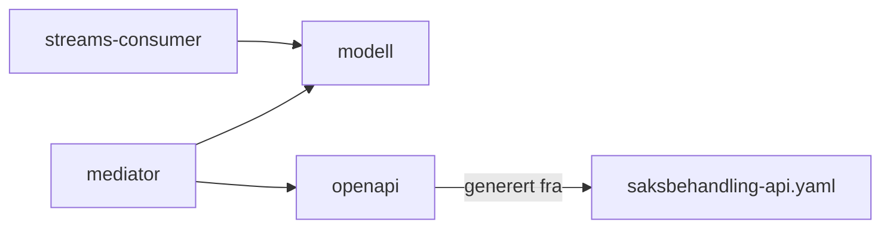

---

## Domenemodell

Domenet følger norsk terminologi og er bygget med hendelsesdrevet arkitektur.

### Konsepter

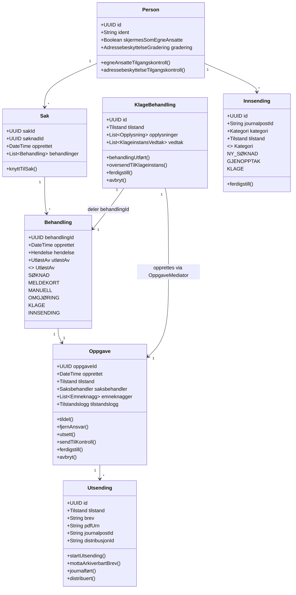

### Nøkkelrelasjoner

- **Person** er rot-entiteten som eier saker, innsendinger og klager
- **Sak** samler alle behandlinger for en person knyttet til én søknad
- **Behandling** er en konkret behandlingsinstans (kan utløses av søknad, meldekort, manuelt, omgjøring, klage eller innsending)

### Sak og Behandling — Opprettelse og knytning

Sammenhengen mellom Sak og Behandling er sentral i domenet. En **Sak opprettes kun én gang**, ved første søknadsbehandling. Alle etterfølgende behandlinger (ny søknad, meldekort, manuell, klage, innsending) **knyttes til en eksisterende sak**.

#### Når opprettes en Sak?

En Sak opprettes **kun** når det kommer en `behandling_opprettet`-hendelse av type **Søknad** der feltet `basertPåBehandling` er `null`. Dette betyr at det er en helt ny søknad som ikke bygger på en tidligere behandling. Alle andre typer (Meldekort, Manuell, Omgjøring) **krever** `basertPåBehandling` og knyttes alltid til en eksisterende sak.

```
behandling_opprettet (type=Søknad, basertPåBehandling=null)
    → SakMediator.opprettSak()
        → Ny Sak opprettes med behandlingskjedeId som sakId
        → Første Behandling legges til i Sak
        → Person opprettes eller gjenbrukes
        → Sak lagres i SakHistorikk
```

**Viktig:** Hvis personen er skjermet (egne ansatte) eller adressebeskyttet, publiseres `avbryt_behandling` i stedet, og saken opprettes ikke videre.

#### Når knyttes en Behandling til en eksisterende Sak?

Alle andre hendelser knyttes til en eksisterende Sak. Knytningen skjer basert på **to kriterier** (minst ett må stemme):

1. **`behandlingskjedeId`** matcher sakens `sakId` — brukes for søknad, meldekort og manuell
2. **`basertPåBehandling`** matcher en behandlingId som allerede finnes i saken — «arving» av en eksisterende behandling
3. **`sakId`** matcher direkte — brukes for klager og innsendinger (via `BehandlingOpprettetHendelse`)

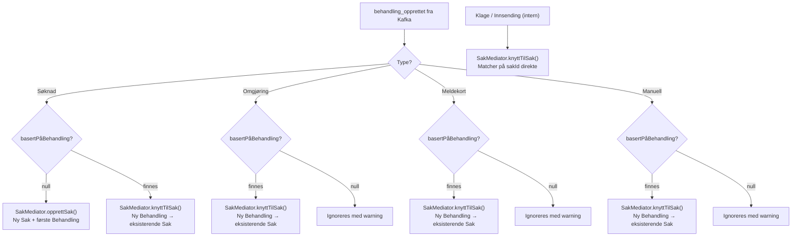

#### Matchingslogikk i Sak-domenet

Når `SakHistorikk.knyttTilSak()` kalles, itereres det over **alle saker** for personen. Hver sak prøver å matche:

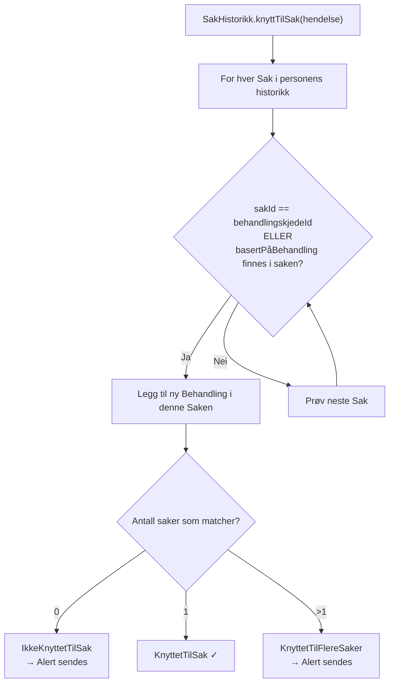

#### Oversikt over alle inngangsporter for Behandling

| Trigger | Hendelsestype | Sak-operasjon | UtløstAv |
|---------|---------------|---------------|----------|
| Første søknad (ny) | `SøknadsbehandlingOpprettetHendelse` | `opprettSak()` — ny Sak | `SØKNAD` |
| Ny søknad på eksisterende sak | `SøknadsbehandlingOpprettetHendelse` | `knyttTilSak()` — match på behandlingskjedeId/basertPå | `SØKNAD` |
| Omgjøring | `OmgjøringBehandlingOpprettetHendelse` | `knyttTilSak()` — krever basertPåBehandling | `OMGJØRING` |
| Meldekort | `MeldekortbehandlingOpprettetHendelse` | `knyttTilSak()` — krever basertPåBehandling | `MELDEKORT` |
| Manuell behandling | `ManuellBehandlingOpprettetHendelse` | `knyttTilSak()` — krever basertPåBehandling | `MANUELL` |
| Klage | `BehandlingOpprettetHendelse` | `knyttTilSak()` — match på sakId | `KLAGE` |
| Innsending | `InnsendingMottattHendelse` | `knyttBehandlingTilSak()` / `knyttEttersendingTilSammeSakSomSøknad()` | `INNSENDING` |

#### Sekvensiell livssyklus for en typisk sak

##### To Mottak-klasser for samme hendelse

Når `behandling_opprettet` av type Søknad publiseres på Kafka, reagerer **to** uavhengige Mottak-klasser på den samme meldingen. Dette er mulig fordi Rapids & Rivers tillater flere lyttere på samme hendelse. De har helt forskjellige ansvarsområder:

| | `BehandlingOpprettetMottak` | `SøknadBehandlingOpprettetMottak` |
|---|---|---|
| **Lytter på** | `behandling_opprettet` (Søknad, Meldekort, Manuell) | `behandling_opprettet` (kun Søknad) |
| **Krever** | `behandlingskjedeId` | Krever **ikke** `behandlingskjedeId` |
| **Kaller** | `SakMediator` | `InnsendingMediator` |
| **Ansvar** | Opprette/knytte Sak og Behandling | Automatisk ferdigstille ventende Innsendinger |

**`BehandlingOpprettetMottak`** håndterer **Sak-livssyklusen**: oppretter ny Sak (hvis ny søknad) eller knytter Behandling til eksisterende Sak. Håndterer også Meldekort og Manuell.

**`SøknadBehandlingOpprettetMottak`** håndterer en **sideeffekt for Innsendinger**: Når dp-behandling bekrefter at en søknad har fått en behandling, sjekker den om det finnes en ventende Innsending for samme søknad. Hvis ja, ferdigstilles Innsendingen automatisk og tilhørende oppgave avbrytes — fordi dp-behandling nå har tatt over.

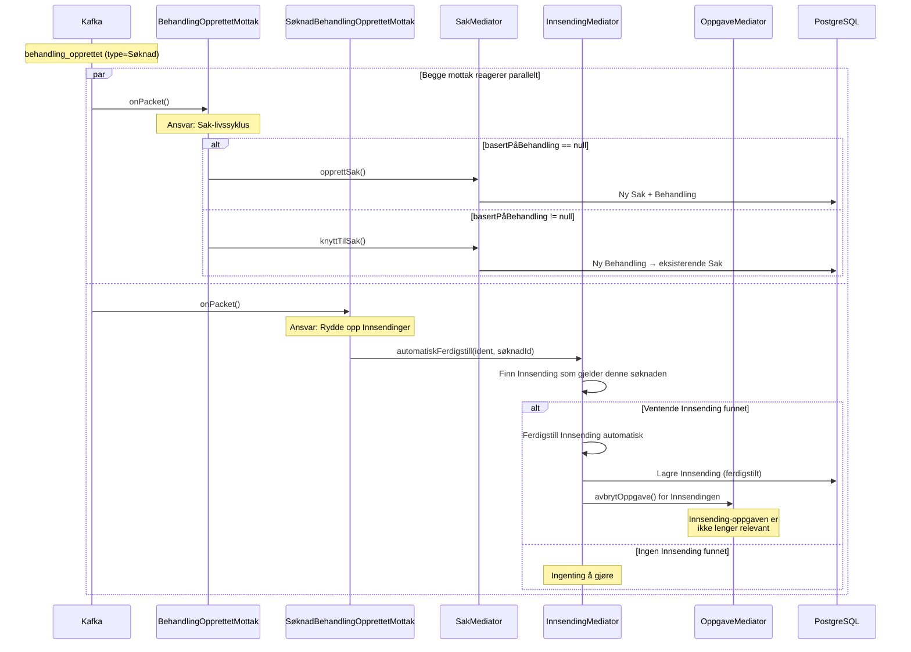

##### Hvorfor to separate mottak?

Bakgrunnen er at en bruker kan ha sendt inn en **Innsending** (f.eks. en søknad via papir/annet) som saksbehandlere manuelt jobber med. Når dp-behandling deretter oppretter en formell behandling for den samme søknaden, er Innsending-oppgaven overflødig. `SøknadBehandlingOpprettetMottak` sørger for denne oppryddingen.

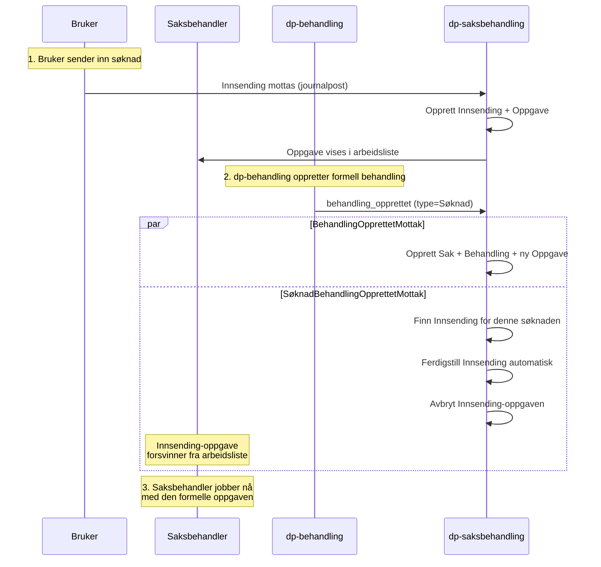

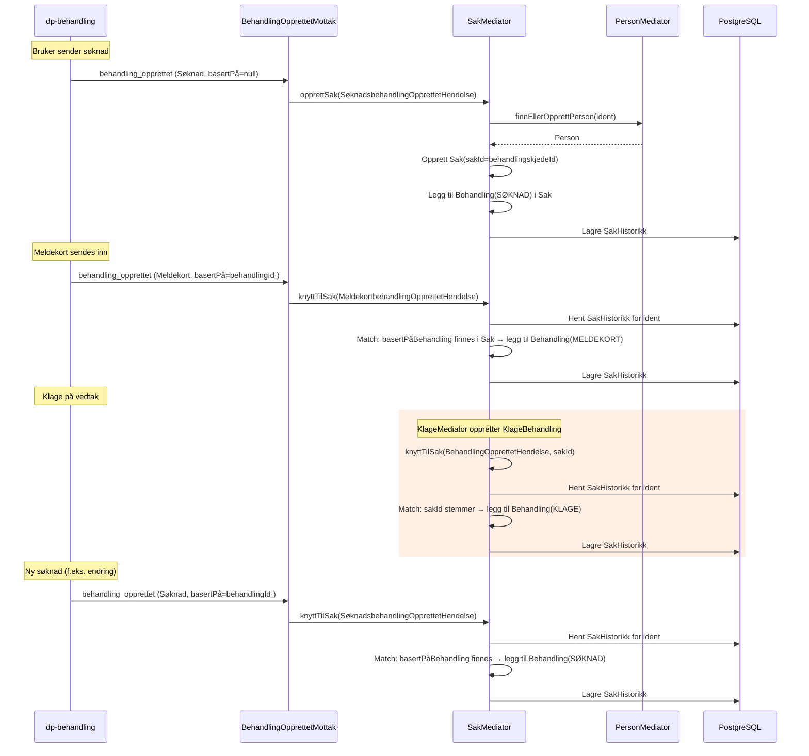
- **Oppgave** er arbeidsoppgaven en saksbehandler jobber med — har kompleks tilstandsmaskin
- **Utsending** håndterer utsending av vedtaksbrev (arkivering → journalføring → distribusjon)
- **KlageBehandling** er en egen behandlingsflyt for klager med steg-basert arbeidsflyt — **oppretter alltid en Oppgave** via `OppgaveMediator.opprettOppgaveForKlageBehandling()`, og knyttes til en Behandling og Sak med felles `behandlingId`
- **Innsending** håndterer innkommende dokumenter og kategoriserer dem

---

## Tilstandsmaskiner

### Oppgave — Tilstandsdiagram

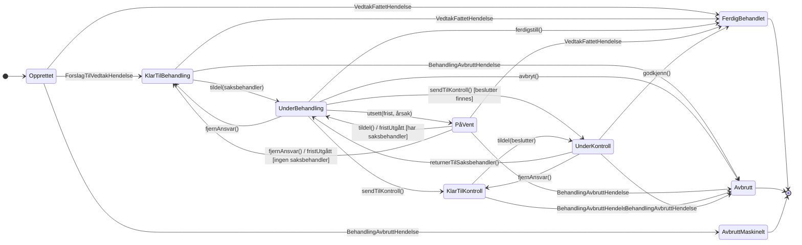

#### Viktige regler (guards)

| Regel | Beskrivelse |
|-------|-------------|
| **Eierskap** | Saksbehandler må eie oppgaven for å gjøre endringer |
| **Beslutter-rolle** | Kun besluttere kan tildeles kontroll-oppgaver |
| **Separation of duties** | Beslutter kan ikke være samme person som saksbehandler |
| **Gosys-brev-kontroll** | Gosys-brev må kvitteres ut før godkjenning i kontroll |
| **Adressebeskyttelse** | Tilgangskontroll for fortrolige/strengt fortrolige personer |
| **Egne ansatte** | Tilgangskontroll for NAV-ansatte som brukere |

### KlageBehandling — Tilstandsdiagram

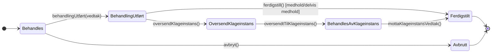

#### Klage-beslutninger

| Utfall | Beskrivelse | Neste steg |
|--------|-------------|------------|
| **OPPRETTHOLDELSE** | Vedtaket opprettholdes | Oversendes til Klageinstans |
| **MEDHOLD** | Klagen gis medhold | Ferdigstilles direkte |
| **DELVIS_MEDHOLD** | Delvis medhold | Ferdigstilles direkte |
| **AVVIST** | Klagen avvises | Oversendes til Klageinstans |

### Utsending — Tilstandsdiagram

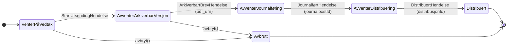

### Innsending — Tilstandsdiagram

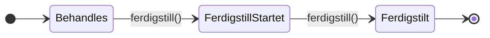

#### Innsending-resultater

| Resultat | Beskrivelse |
|----------|-------------|
| `Ingen` | Innsending avvises/avsluttes uten videre behandling |
| `Klage` | Klagebehandling opprettes |
| `RettTilDagpenger` | Ny dagpengebehandling opprettes |

---

## Databasediagram

### ER-diagram

```mermaid
erDiagram
    PERSON_V1 {
        uuid id PK
        varchar_11 ident UK
        boolean skjermes_som_egne_ansatte
        text adressebeskyttelse_gradering
        timestamp registrert_tidspunkt
        timestamp endret_tidspunkt
    }

    SAK_V2 {
        uuid id PK
        uuid person_id FK
        uuid soknad_id
        timestamp_tz opprettet
        text arena_sak_id
        boolean er_dp_sak
        timestamp registrert_tidspunkt
        timestamp endret_tidspunkt
    }

    BEHANDLING_V1 {
        uuid id PK
        uuid person_id FK
        uuid sak_id FK
        timestamp_tz opprettet
        text behandling_type
        timestamp registrert_tidspunkt
        timestamp endret_tidspunkt
    }

    OPPGAVE_V1 {
        uuid id PK
        uuid behandling_id FK
        text tilstand
        timestamp_tz opprettet
        text saksbehandler_ident
        text kontrollert_brev
        text melding_om_vedtak_kilde
        timestamp registrert_tidspunkt
        timestamp endret_tidspunkt
    }

    EMNEKNAGG_V1 {
        bigserial id PK
        uuid oppgave_id FK
        text emneknagg
    }

    OPPGAVE_TILSTAND_LOGG_V1 {
        uuid id PK
        uuid oppgave_id FK
        text tilstand
        text hendelse_type
        jsonb hendelse
        timestamp tidspunkt
    }

    NOTAT_V1 {
        uuid id PK
        uuid oppgave_tilstand_logg_id FK
        text tekst
        timestamp endret_tidspunkt
    }

    HENDELSE_V1 {
        uuid behandling_id PK_FK
        text hendelse_type
        jsonb hendelse_data
    }

    UTSENDING_V1 {
        uuid id PK
        uuid oppgave_id FK
        uuid behandling_id FK
        text sak_id FK
        text tilstand
        text brev
        text pdf_urn
        text journalpost_id
        text distribusjon_id
        text type
        timestamp registrert_tidspunkt
        timestamp endret_tidspunkt
    }

    INNSENDING_V1 {
        uuid id PK
        uuid person_id FK
        text journalpost_id
        timestamp mottatt
        text skjema_kode
        text kategori
        text tilstand
        text behandler_ident
        timestamp registrert_tidspunkt
        timestamp endret_tidspunkt
    }

    INNSENDING_TILSTAND_LOGG_V1 {
        uuid id PK
        uuid innsending_id FK
        text tilstand
        text hendelse_type
        jsonb hendelse
        timestamp tidspunkt
    }

    KLAGE_V1 {
        uuid id PK
        text tilstand
        jsonb opplysninger
        text journalpost_id
        text behandlende_enhet
        timestamp registrert_tidspunkt
        timestamp endret_tidspunkt
    }

    KLAGE_TILSTAND_LOGG_V1 {
        uuid id PK
        uuid klage_id FK
        text tilstand
        text hendelse_type
        jsonb hendelse
        timestamp tidspunkt
    }

    KLAGEINSTANS_VEDTAK_V1 {
        uuid id PK
        uuid klage_id FK
        text type
        text utfall
        timestamp avsluttet
        text_array journalpost_ider
        timestamp registrert_tidspunkt
    }

    SAKSBEHANDLING_STATISTIKK_V1 {
        uuid tilstand_id PK
        uuid oppgave_id
        uuid sak_id
        uuid behandling_id
        text tilstand
        timestamp tilstand_tidspunkt
        timestamp mottatt
        text person_ident
        text saksbehandler_ident
        text beslutter_ident
        text utlost_av
        boolean overfort_til_statistikk
    }

    PERSON_V1 ||--o{ SAK_V2 : "har"
    PERSON_V1 ||--o{ BEHANDLING_V1 : "har"
    PERSON_V1 ||--o{ INNSENDING_V1 : "har"
    SAK_V2 ||--o{ BEHANDLING_V1 : "inneholder"
    BEHANDLING_V1 ||--o{ OPPGAVE_V1 : "har"
    BEHANDLING_V1 ||--o| HENDELSE_V1 : "har"
    OPPGAVE_V1 ||--o{ EMNEKNAGG_V1 : "merket med"
    OPPGAVE_V1 ||--o{ OPPGAVE_TILSTAND_LOGG_V1 : "logg"
    OPPGAVE_V1 ||--o{ UTSENDING_V1 : "utsendinger"
    OPPGAVE_TILSTAND_LOGG_V1 ||--o| NOTAT_V1 : "har"
    INNSENDING_V1 ||--o{ INNSENDING_TILSTAND_LOGG_V1 : "logg"
    KLAGE_V1 ||--o{ KLAGE_TILSTAND_LOGG_V1 : "logg"
    KLAGE_V1 ||--o{ KLAGEINSTANS_VEDTAK_V1 : "vedtak"
    KLAGE_V1 ||--|| BEHANDLING_V1 : "deler behandlingId"
    BEHANDLING_V1 ||--o{ UTSENDING_V1 : "har"
```

### Tabelloversikt

| Tabell | Formål |
|--------|--------|
| `PERSON_V1` | Persondata med skjerming og adressebeskyttelse |
| `SAK_V2` | Saker knyttet til person og søknad |
| `BEHANDLING_V1` | Behandlingsinstanser (søknad, meldekort, manuell) |
| `OPPGAVE_V1` | Oppgaver med tilstand og saksbehandlertilknytning |
| `EMNEKNAGG_V1` | Tagger/kategorier på oppgaver |
| `OPPGAVE_TILSTAND_LOGG_V1` | Fullstendig tilstandshistorikk per oppgave |
| `NOTAT_V1` | Saksbehandlernotater knyttet til tilstandsendringer |
| `HENDELSE_V1` | Hendelsesdata knyttet til behandling (JSONB) |
| `UTSENDING_V1` | Utsending av vedtaksbrev med arkiverings- og distribusjonssporing |
| `INNSENDING_V1` | Innkommende dokumenter |
| `INNSENDING_TILSTAND_LOGG_V1` | Tilstandshistorikk for innsendinger |
| `KLAGE_V1` | Klagebehandlinger med opplysninger (JSONB). **Merk:** `KLAGE_V1.id` = `BEHANDLING_V1.id` — de deler `behandlingId`, og det opprettes alltid en Oppgave for hver klage |
| `KLAGE_TILSTAND_LOGG_V1` | Tilstandshistorikk for klager |
| `KLAGEINSTANS_VEDTAK_V1` | Vedtak fra Klageinstans (KABAL) |
| `SAKSBEHANDLING_STATISTIKK_V1` | Statistikk for oppgavebehandling |

---

## API-endepunkter

### OppgaveApi

| Metode | Sti | Beskrivelse |
|--------|-----|-------------|
| `POST` | `/person/personId` | Hent person-ID fra fødselsnummer |
| `GET` | `/person/{personId}` | Hent personoversikt med oppgaver |
| `POST` | `/person/oppgaver` | Hent oppgaver for en person |
| `GET` | `/oppgave` | Søk/list oppgaver med filtre |
| `PUT` | `/oppgave/neste` | Tildel og hent neste ledige oppgave |
| `GET` | `/oppgave/{oppgaveId}` | Hent oppgavedetaljer |
| `PUT` | `/oppgave/{oppgaveId}/tildel` | Tildel oppgave til saksbehandler |
| `PUT` | `/oppgave/{oppgaveId}/legg-tilbake` | Legg oppgave tilbake i køen |
| `PUT` | `/oppgave/{oppgaveId}/utsett` | Utsett oppgave med frist og årsak |
| `PUT` | `/oppgave/{oppgaveId}/send-til-kontroll` | Send oppgave til totrinnskontroll |
| `PUT` | `/oppgave/{oppgaveId}/returner-til-saksbehandler` | Returner fra kontroll til saksbehandler |
| `PUT` | `/oppgave/{oppgaveId}/ferdigstill` | Ferdigstill oppgave |
| `PUT` | `/oppgave/{oppgaveId}/avbryt` | Avbryt oppgave |
| `PUT` | `/oppgave/{oppgaveId}/kontrollert-brev` | Kvitter ut brevkontroll (JA/NEI/IKKE_RELEVANT) |
| `PUT` | `/oppgave/{oppgaveId}/melding-om-vedtak-kilde` | Sett kilde for melding om vedtak |
| `PUT` | `/oppgave/{oppgaveId}/notat` | Lagre notat på oppgave |
| `DELETE` | `/oppgave/{oppgaveId}/notat` | Slett notat fra oppgave |
| `GET` | `/behandling/{behandlingId}/oppgaveId` | Hent oppgave-ID for behandling |

### KlageApi

| Metode | Sti | Beskrivelse |
|--------|-----|-------------|
| `POST` | `/klage/opprett` | Opprett klage (maskin-til-maskin) |
| `POST` | `/klage/opprett-manuelt` | Opprett klage manuelt (bruker-auth) |
| `GET` | `/klage/{behandlingId}` | Hent klagedetaljer |
| `PUT` | `/klage/{behandlingId}/opplysning/{opplysningId}` | Oppdater opplysning i klage |
| `PUT` | `/klage/{behandlingId}/ferdigstill` | Ferdigstill klagebehandling |
| `PUT` | `/klage/{behandlingId}/trekk` | Trekk klage |

### SakApi

| Metode | Sti | Beskrivelse |
|--------|-----|-------------|
| `GET` | `/behandling/{behandlingId}/sakId` | Hent Dagpenger Sak-ID for behandling (maskin-auth) |

### InnsendingApi

| Metode | Sti | Beskrivelse |
|--------|-----|-------------|
| `GET` | `/innsending/{behandlingId}` | Hent innsendingsdetaljer med tilknyttede saker |
| `PUT` | `/innsending/{behandlingId}/ferdigstill` | Ferdigstill innsending (opprett behandling/klage eller avvis) |

---

## Hendelsesflyt (Rapids & Rivers)

En sentral egenskap ved Rapids & Rivers er at **én Kafka-melding kan fanges opp av flere Mottak-klasser parallelt**. Hver Mottak registrerer seg som lytter med sine egne filtre, og alle som matcher mottar meldingen uavhengig av hverandre.

### Hendelser fra dp-behandling

dp-behandling er den primære kilden til hendelser. Alle hendelser publiseres på Kafka og mottas av én eller flere Mottak-klasser.

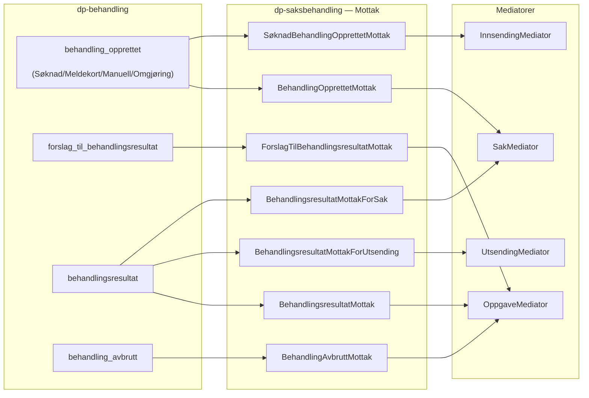

| Hendelse | Filter | Mottak-klasse | Kaller | Beskrivelse |
|----------|--------|---------------|--------|-------------|
| `behandling_opprettet` | type ∈ [Søknad, Meldekort, Manuell, Omgjøring] | **BehandlingOpprettetMottak** | `sakMediator.opprettSak()` / `.knyttTilSak()` | Oppretter ny Sak (første søknad) eller knytter Behandling til eksisterende Sak |
| `behandling_opprettet` | type = Søknad | **SøknadBehandlingOpprettetMottak** | `innsendingMediator.automatiskFerdigstill()` | Ferdigstiller ventende Innsending for samme søknad og avbryter tilhørende oppgave |
| `forslag_til_behandlingsresultat` | type ∈ [Søknad, Meldekort, Manuell, Omgjøring] | **ForslagTilBehandlingsresultatMottak** | `oppgaveMediator.opprettEllerOppdaterOppgave()` | Oppgave → KLAR_TIL_BEHANDLING |
| `behandlingsresultat` | type ∈ [Søknad, Manuell, Meldekort, Omgjøring] | **BehandlingsresultatMottak** | `oppgaveMediator.ferdigstillOppgave()` | Vedtak fattet — oppgave → FERDIG_BEHANDLET |
| `behandlingsresultat` | type ∈ [Søknad, Manuell, Meldekort, Omgjøring] | **BehandlingsresultatMottakForUtsending** | `utsendingMediator.startUtsendingForVedtakFattet()` | Starter utsending av vedtaksbrev |
| `behandlingsresultat` | type = Søknad | **BehandlingsresultatMottakForSak** | `sakMediator.merkSakenSomDpSak()` | Merker saken som DP-sak og publiserer `vedtak_fattet_utenfor_arena` |
| `behandling_avbrutt` | type ∈ [Søknad, Meldekort, Manuell, Omgjøring] | **BehandlingAvbruttMottak** | `oppgaveMediator.avbrytOppgave()` | Oppgave → AVBRUTT |

#### Hvorfor flere Mottak per hendelse?

Nøkkelpoenget er **separation of concerns**. Samme Kafka-melding trigger forskjellige sideeffekter:

- **`behandling_opprettet`** → `BehandlingOpprettetMottak` håndterer Sak-livssyklusen (for Søknad, Meldekort, Manuell og Omgjøring), mens `SøknadBehandlingOpprettetMottak` rydder opp i overflødige Innsendinger (kun for Søknad)
- **`behandlingsresultat`** → tre Mottak som hver gjør sin ting: ferdigstille oppgaven, starte utsending av brev, og merke saken

### Hendelser fra andre eksterne systemer

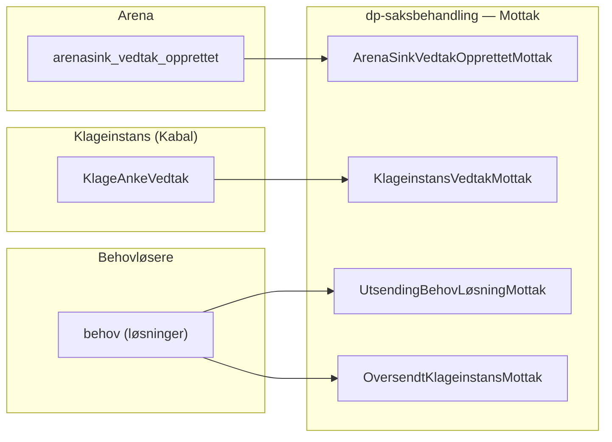

| Hendelse | Kilde | Mottak-klasse | Kaller | Beskrivelse |
|----------|-------|---------------|--------|-------------|
| `arenasink_vedtak_opprettet` | Arena | **ArenaSinkVedtakOpprettetMottak** | `sakMediator.oppdaterSakMedArenaSakId()` + `utsendingMediator.startUtsendingForVedtakFattet()` | Vedtak fra legacy Arena-systemet — kobler Arena-sakId og starter utsending |
| `KlageAnkeVedtak` | Kabal (Klageinstans) | **KlageinstansVedtakMottak** | `klageMediator.mottaKlageinstansVedtak()` | Klageinstans har fattet vedtak — filter: `kilde = "DAGPENGER"` |
| `behov` (ArkiverbartBrev, Journalføring, Distribuering) | Behovløsere | **UtsendingBehovLøsningMottak** | `utsendingMediator.mottaUrn/Journalført/Distribuert()` | Løsninger for utsendingsbehov — driver brev gjennom arkivering → journalføring → distribusjon |
| `behov` (OversendelseKlageinstans) | Behovløser | **OversendtKlageinstansMottak** | `klageMediator.oversendtTilKlageinstans()` | Bekreftelse på at klage er oversendt til Klageinstans |

### Interne hendelser (dp-saksbehandling → dp-saksbehandling)

Noen hendelser publiseres og konsumeres internt i applikasjonen via Kafka:

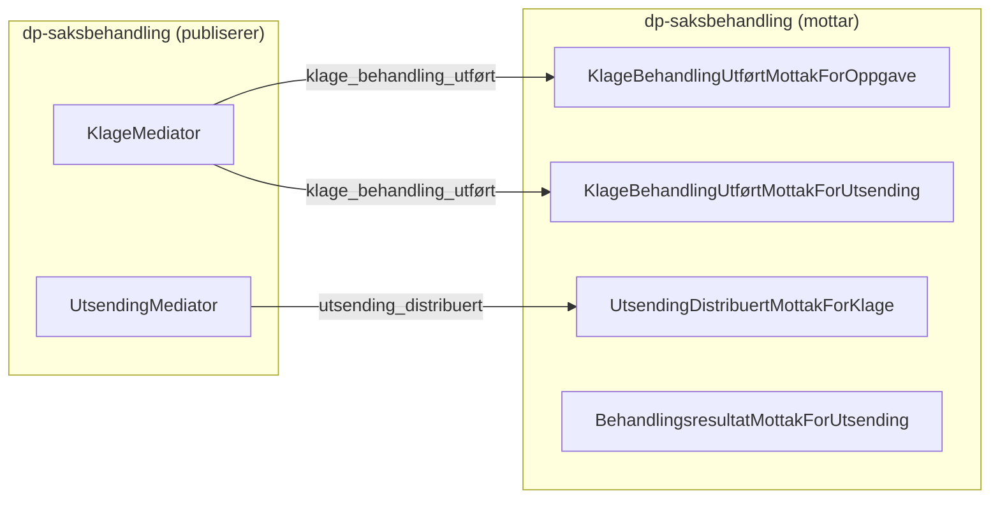

| Hendelse | Mottak-klasse(r) | Kaller | Beskrivelse |
|----------|-----------------|--------|-------------|
| `klage_behandling_utført` | **KlageBehandlingUtførtMottakForOppgave** | `oppgaveMediator.ferdigstillOppgave()` | Ferdigstiller klage-oppgaven |
| `klage_behandling_utført` | **KlageBehandlingUtførtMottakForUtsending** | `utsendingMediator.mottaStartUtsending()` | Starter utsending av klagevedtaksbrev |
| `utsending_distribuert` (type=KLAGEMELDING) | **UtsendingDistribuertMottakForKlage** | `klageMediator.vedtakDistribuert()` | Bekrefter at klagevedtaksbrev er distribuert — ferdigstiller klagebehandling |
| `dp_saksbehandling_behandlingsresultat_retry` | **BehandlingsresultatMottakForUtsending** | `utsendingMediator.startUtsendingForVedtakFattet()` | Intern retry-mekanisme for utsending |

### Utgående hendelser (publiseres til andre systemer)

| Hendelse | Publisert av | Mottaker | Beskrivelse |
|----------|-------------|----------|-------------|
| `avbryt_behandling` | `SakMediator` | dp-behandling | Ber om å avbryte behandling (f.eks. skjermet/adressebeskyttet person) |
| `vedtak_fattet_utenfor_arena` | `BehandlingsresultatMottakForSak` | Andre systemer | Signaliserer at vedtak er fattet utenfor Arena |
| `klage_behandling_utført` | `KlageMediator` | Internt + andre | Klagebehandling er fullført |
| `oppgave_til_statistikk_v3` | `StatistikkJob` | Statistikksystemer | Oppgavestatistikk for rapportering |
| `saksbehandling_alert` | `AlertManager` | Alerting | Systemalarmer ved feil |

### Behov-mønster (Request/Response)

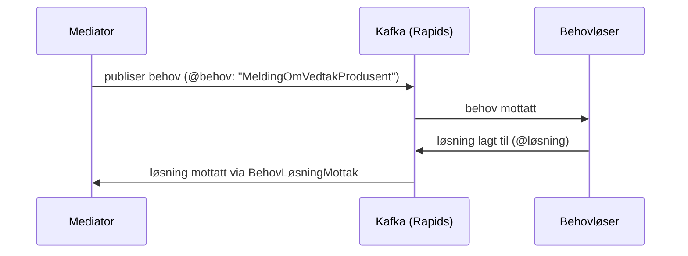

| Behov | Beskrivelse |
|-------|-------------|
| `MeldingOmVedtakProdusent` | Produser melding om vedtak (PDF) |
| `Innsending` | Håndter innsendt dokument |
| `OversendKlageinstans` | Oversend klage til Klageinstans |
| `Journalføring` | Journalfør dokument i Joark |
| `Distribuering` | Distribuer brev til mottaker |

### Komplett hendelsesflyt: Søknad → Vedtak

Viser hvordan én søknad trigger mange Mottak parallelt gjennom hele livssyklusen:

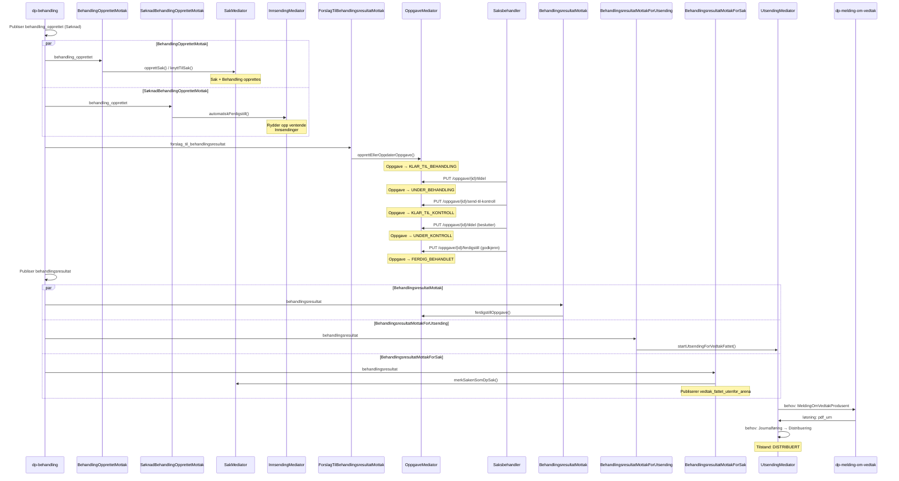

### Komplett hendelsesflyt: Klagebehandling

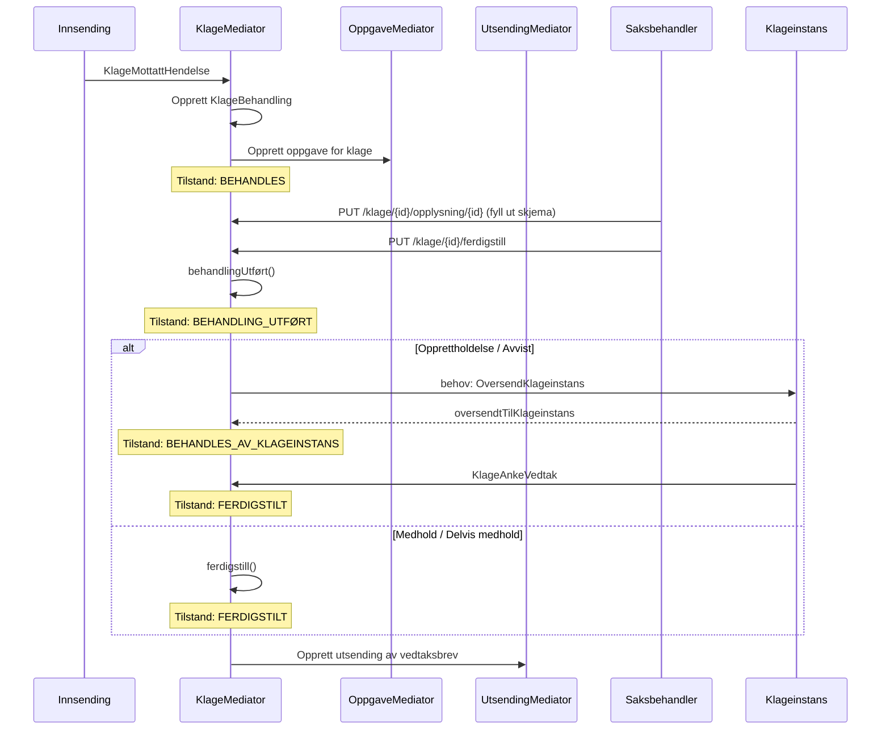

---

## Streams Consumer

Kafka Streams-konsumenter som lytter på eksterne topics for personstatusendringer.

### Topologier

```mermaid
graph LR
    subgraph "Kafka Topics"
        Leesah["leesah-v1 (PersonHendelse)"]
        Skjerming["skjermede-personer-v1"]
    end

    subgraph "Streams Consumer"
        LT["LeesahTopology"]
        ST["SkjermetPersonStatusTopology"]
    end

    subgraph "Mediator"
        PM["PersonMediator"]
    end

    Leesah -->|Avro| LT
    LT -->|"ADRESSEBESKYTTELSE_V1"| PM
    Skjerming -->|String/Boolean| ST
    ST -->|skjermet status| PM
```

| Topology | Topic | Format | Filtrering | Formål |
|----------|-------|--------|------------|--------|
| `LeesahTopology` | `pdl.leesah-v1` | Avro | `ADRESSEBESKYTTELSE_V1` | Oppdaterer adressebeskyttelsegradering for personer |
| `SkjermetPersonStatusTopology` | `nom.skjermede-personer-v1` | String | Alle meldinger | Oppdaterer skjerming-status (egne ansatte) |

---

## Infrastruktur og deploy

### NAIS-konfigurasjon

| Parameter | Verdi |
|-----------|-------|
| **App** | `dp-saksbehandling` |
| **Namespace** | `teamdagpenger` |
| **Replicas** | 3 |
| **Minne** | 256Mi (request) / 512Mi (limit) |
| **CPU** | 200m |
| **Database** | PostgreSQL 15 (GCP CloudSQL) |
| **Kafka** | nav-dev / nav-prod pool |
| **Autentisering** | Azure AD med rollegrupper |

### Tilgangsgrupper (Azure AD)

| Rolle | Beskrivelse |
|-------|-------------|
| **Saksbehandler** | Standard tilgang til oppgavebehandling |
| **Beslutter** | Kan utføre totrinnskontroll |
| **Egne ansatte** | Tilgang til oppgaver for NAV-ansatte |

### Integrasjoner

```mermaid
graph TB
    DPS["dp-saksbehandling"]

    DPS -->|"REST"| PDL["PDL API (Persondata)"]
    DPS -->|"REST"| Skjerming["Skjermingsregisteret"]
    DPS -->|"REST"| DPBehandling["dp-behandling"]
    DPS -->|"REST"| DPMoV["dp-melding-om-vedtak"]
    DPS -->|"Kafka"| Rapids["Kafka Rapids & Rivers"]

    PDL -->|"person, adressebeskyttelse"| DPS
    Skjerming -->|"egne ansatte status"| DPS
    DPBehandling -->|"behandlingsdata"| DPS
    DPMoV -->|"vedtaksbrev (PDF)"| DPS
```

---

## Bygge og kjøre

```bash
# Bygg hele prosjektet
./gradlew build

# Kjør alle tester
./gradlew test

# Kjør tester for spesifikt modul
./gradlew :modell:test
./gradlew :mediator:test

# Kjør en enkelt testklasse
./gradlew test --tests OppgaveTilstandTest

# Kjør en enkelt testmetode
./gradlew test --tests "OppgaveTilstandTest.Skal på nytt kunne tildele*"

# Lint
./gradlew ktlintCheck
./gradlew ktlintFormat

# Generer OpenAPI-modeller
./gradlew :openapi:fabriktGenerate
```

### Teknologier

| Teknologi | Bruksområde |
|-----------|-------------|
| **Kotlin** | Programmeringsspråk |
| **Ktor** | HTTP-rammeverk |
| **PostgreSQL 15** | Database |
| **Liquibase** | Databasemigrasjoner |
| **Kafka** | Meldingshåndtering (Rapids & Rivers) |
| **Kafka Streams** | Strømprosessering av persondata |
| **Azure AD** | Autentisering og autorisasjon |
| **Fabrikt** | OpenAPI kodegenerering |
| **Prometheus** | Metrikker |
| **JUnit 5 + Kotest** | Testing |
| **MockK** | Mocking |
| **ktlint** | Kodeformatering |

---

## Kontakt

- **Slack:** #team-dagpenger-behandling
- **Swagger:** https://dp-saksbehandling.intern.dev.nav.no/openapi
