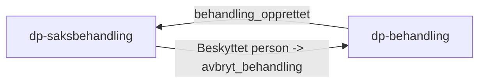
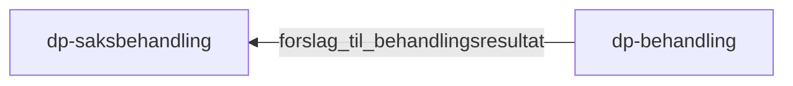
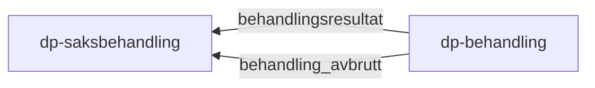

### Flyt av events mellom dp-behandling og dp-saksbehandling

### 1. Oppgave opprettes eller si ifra at behandling må avbrytes

### 2. Oppgave gjøres klar til behandling

### 3. Oppgave ferdigstilles eller avbrytes

