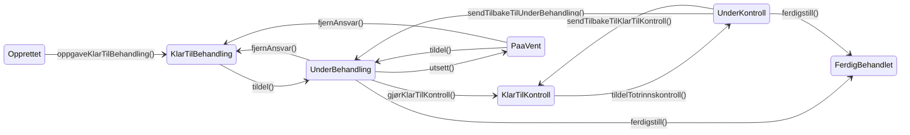

### Tilstander i Oppgave

```mermaid
stateDiagram-v2
    direction LR

    Opprettet --> KlarTilBehandling : oppgaveKlarTilBehandling()
    KlarTilBehandling --> UnderBehandling : tildel()
    UnderBehandling --> KlarTilBehandling : fjernAnsvar()
    UnderBehandling --> KlarTilKontroll : gjørKlarTilKontroll()
    UnderBehandling --> PaaVent : utsett()
    UnderBehandling --> FerdigBehandlet : ferdigstill()
    KlarTilKontroll --> UnderKontroll : tildelTotrinnskontroll()
    UnderKontroll --> FerdigBehandlet : ferdigstill()
    UnderKontroll --> UnderBehandling : sendTilbakeTilUnderBehandling()
    UnderKontroll --> KlarTilKontroll : sendTilbakeTilKlarTilKontroll()
    PaaVent --> UnderBehandling : tildel()
    PaaVent --> KlarTilBehandling : fjernAnsvar()
```