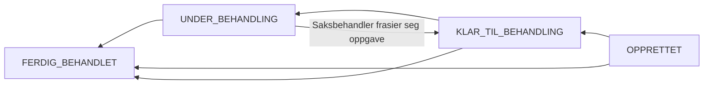

### Tilstander i Oppgave

### 1. Tilstander og tilstandsendringer

```mermaid
graph RL
  A["OPPRETTET"] --> B["KLAR_TIL_BEHANDLING"] --> C["UNDER_BEHANDLING"] --> D["FERDIG_BEHANDLET"]
  C["UNDER_BEHANDLING"] --> |"Saksbehandler frasier seg oppgave"| B["KLAR_TIL_BEHANDLING"]
  
  A["OPPRETTET"] --> D["FERDIG_BEHANDLET"]
  B["KLAR_TIL_BEHANDLING"] --> D["FERDIG_BEHANDLET"]
```
